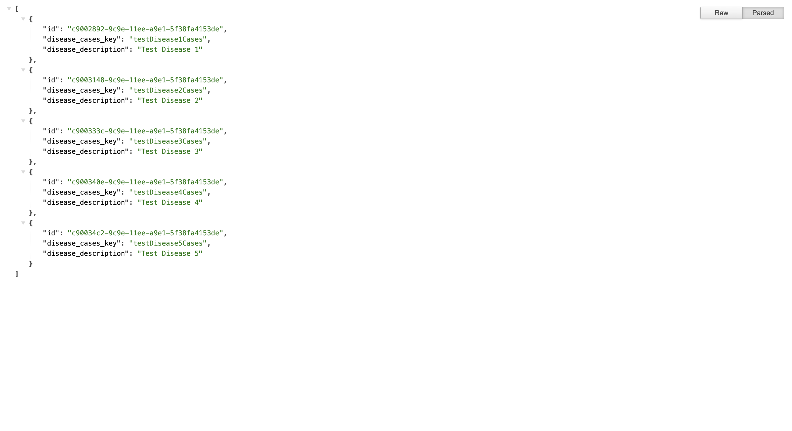

# Heat Map API

## Getting started

```
git clone https://github.com/brothersdw/heatmap-api.git
```

### Installing dependencies

- To install all dependencies for `heatmap-api` run `npm install` while in the `heatmap-api` parent directory.

### Setting up MySQL database

- You will need to first set up a local db.
- Once you have a database created, create a table called `diseases`. You have to create this table with a specific format as the column names are explicitly looked at within api. Below you will find the commands to create the table and insert test values within it (the `disease_cases_key` and `disease_description` values can be anything but column names MUST be exact):
  <br />

1. Create the table:

```
CREATE TABLE my_test_db.diseases (`id` VARCHAR(200) PRIMARY KEY, disease_cases_key VARCHAR(200), disease_description VARCHAR(200)) ENGINE=InnoDB DEFAULT CHARSET=utf8
```

2. Insert values into table:
   <br />

```
INSERT INTO diseases (`id`,
disease_cases_key,
disease_description
)
values (
UUID(),
'testDisease1Cases',
'Test Disease 1'
),
(
UUID(),
'testDisease2Cases',
'Test Disease 2'
),
(
UUID(),
'testDisease3Cases',
'Test Disease 3'
),
(
UUID(),
'testDisease4Cases',
'Test Disease 4'
),
(
UUID(),
'testDisease5Cases',
'Test Disease 5'
)

```

- After creating the table you will need to copy the `knexfile-example.js` into `knexfile.js` and replace `<user>`, `<password>` and `<database>` with your username, password and database name for your local database.

```
cp knexfile-example.js knexfile.js
```

### Start Heatmap API

- Once the table has been built and you have configured your `knexfile.js` you can bring up `heatmap-api` by either running `npm start` (this means you don't care about developing you just want to see functionality) or you can run `npm run dev` in this mode nodemon will run and everytime you save a file that has an effect on api functionality, api will restart to implement and test changes.

- After starting API you can test the api and that the api is querying the table that you created without issue by visiting http://localhost:3008/get-diseases. You should see the below if you configured everything correctly:



#### Updating county boundaries

- You will need to `POST` to http://localhost:3008/update-florida-coordinates before running the below `GET` requests if `/data/county-boundaries.json` does not exist.
- When you have confirmed that the `county-boundaries.json` file exists you can also run a `GET` request to the other routes to test functionality:
  - http://localhost:3008/get-florida-county-coordinates
  - http://localhost:3008/get-florida-mapbox-data

#### Creating/Updating geoJSON file

- This file is not needed for functionality but gives a visual of the county boundaries when displayed in Gitlab/Github.
- You can create this file by `POST`ing to http://localhost:3008/build-florida-geojson
